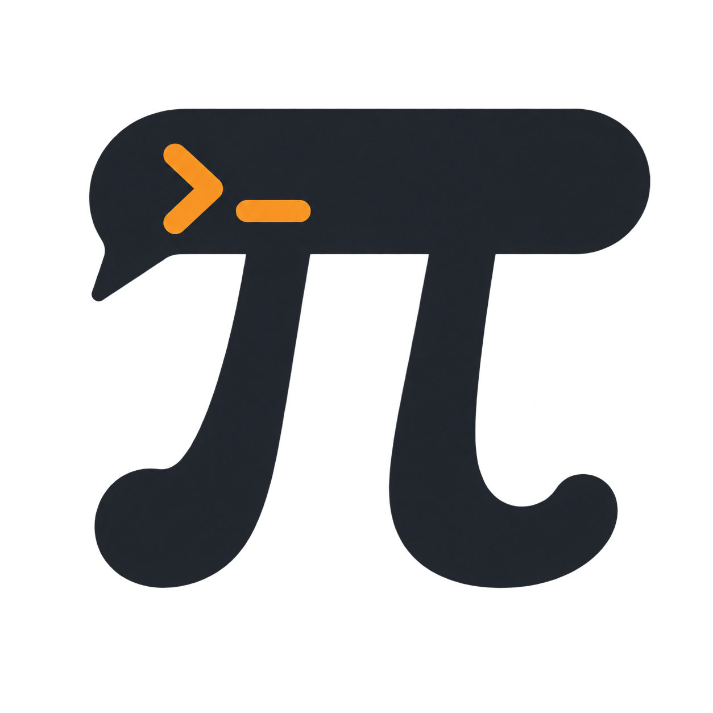
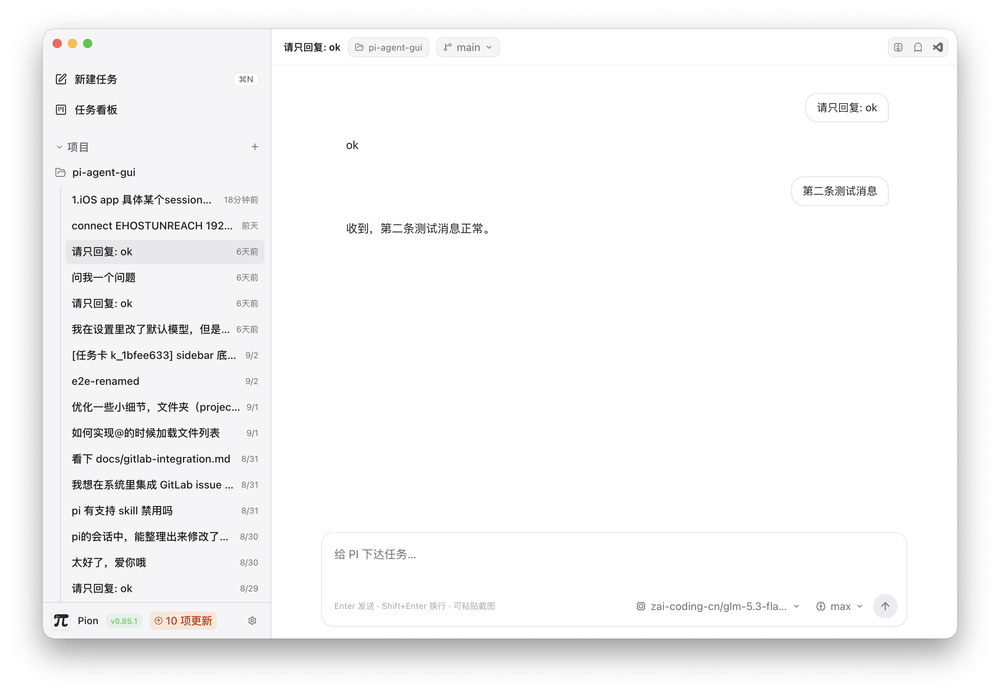

<div align="center">
  
  <h1>Pion</h1>
  <p><strong>PI 的本地桌面 GUI —— 原生接入、专注交互、开箱即用。</strong></p>
  <p>
    <a href="README.md">English</a> | <a href="README_CN.md">简体中文</a>
  </p>
  <p>
    
    
    
    
  </p>
</div>

Pion 是专为 [PI](https://pi.dev) 打造的本地桌面客户端，深度协同官方 Agent Runtime，专注于提供直观、高效的桌面交互与会话管理体验。

- **官方 RPC 驱动**：基于标准 `pi --mode rpc` 协议通信，完整保留 PI 原生执行逻辑与运行环境。
- **环境无缝复用**：直接复用本机已有的 PI 社区扩展、Prompt 模板与 Skills，与 CLI 共用同一套环境与配置。
- **单源数据流转**：直接以 PI 的 Session JSONL 作为对话历史唯一真相来源，会话数据完整保留在本地环境中。

<div align="center">
  
</div>

## 功能特性

- **多会话工作台**：支持多项目与会话快速切换，内置最多 4 个 Runtime 池化复用；支持流式输出、思维链展示、工具调用卡片（参数与结果可展开）、截图直接粘贴，以及运行中的动态引导（Steer）与中断（Abort）。
- **扩展原生交互**：扩展触发的 Select / Confirm / Input / Notify 以原生交互卡片呈现，支持直接点选操作。
- **Slash 命令与补全**：键入 `/` 快速调出已安装扩展命令、Prompt 模板与 Skills，清晰标注来源。
- **模型与思考深度**：自动读取 `~/.pi/agent/models.json` 配置，支持在会话内随时切换模型与思考等级。
- **Git 与工作区管理**：可视化查看分支与 Worktree，支持一键创建独立 Worktree，并快速在 Finder / Ghostty / VS Code 中唤起项目。
- **配置与环境管理**：支持中英文界面切换与深浅主题切换，内置 PI 及扩展的版本检测与更新，提供清晰的 Runtime 状态管理。
- **会话容灾恢复**：当底层进程发生异常时，支持会话状态一键重连与恢复。

## 社区扩展适配

Pion 会自动检测本地已安装的社区扩展并渲染专属 UI：

| 扩展 | 界面表现 |
| --- | --- |
| `@juicesharp/rpiv-todo` | 输入框上方常驻任务面板，实时同步当前会话的 Todo 快照与进展 |
| `@narumitw/pi-plan-mode` | 提供 `plan_mode_question` / `plan_mode_complete` 专属交互卡片，呈现 `/plan` 流程与状态反馈 |
| `@narumitw/pi-goal` | 完整支持 `/goal` 命令及 `goal_complete` / `goal_blocked` / `goal_wait` 状态流转 |
| 更多扩展 | 提供通用工具卡片，支持参数与执行结果展开折叠，完整呈现各类事件 |

## 任务看板（可选）

为项目提供轻量闭环的任务推进机制：**创建卡片 → 派发给 Agent → Agent 自动执行与汇报 → 进入 Review → 人工审核（Done / Reopen）**。

- **事件驱动存储**：卡片状态持久化于项目自身的 `.pion/kanban/events.jsonl` 中，支持 CLI `pi` 与 GUI 协同读写。
- **按需启用**：仅在主动使用看板时在项目目录维护日志，可随时在侧边栏开启或收起看板视图。

## Remote Runtime（Beta）

支持通过 `pion-daemon` 将远程主机上的项目接入 Pion 桌面端，享受与本地一致的多会话、流式输出与看板协作体验。

- 支持配对码、Token 认证及局域网直连。
- 支持移动客户端扫码接入（配套 iOS 客户端正在开发中）。

## 后续计划

- **文件变更对比（Diff）**：在 GUI 中直接审阅 Agent 的代码修改细节。
- **独立终端面板**：集成内置终端，与 PI RPC 通信通道保持独立隔离。

## 快速开始

### 前置要求

- macOS（Apple Silicon）
- Node.js 18+
- 已安装并配置好 [`pi`](https://pi.dev) CLI

### 安装与运行

```bash
# 克隆仓库
git clone https://github.com/zucchiniEvader/pion.git
cd pion

# 安装依赖
npm install

# 启动开发模式
npm run dev

# 构建安装包 (DMG)
npm run dist

# 快速构建应用目录 (macOS .app)
npm run dist:dir
```

首次启动会自动检测本地 PI 环境，选择项目目录即可开启会话。

## 设计原则

- **专注 PI 生态**：专为 PI 打造深度定制的桌面体验，保持产品轻量与纯粹。
- **标准协议通信**：严格基于官方 `pi --mode rpc` 标准 JSONL 管道交互，保障通信稳定与协议透明。
- **安全明确授权**：遵循标准安全边界，所有执行权限与资源访问均采用显式授权确认。
- **本地自托管优先**：数据存储与通信完全由用户自主掌控，保障项目代码与对话隐私。

## License

基于 [MIT](LICENSE) 协议开源。欢迎查阅 [CONTRIBUTING.md](CONTRIBUTING.md) 参与贡献，安全相关事宜请参阅 [SECURITY.md](SECURITY.md)。
